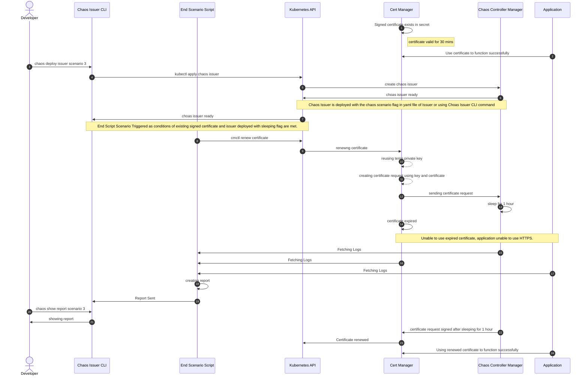

# Sequence Diagram for end to end scenarios #

## An example of end-to-end scenarios: ##
1. Launch the base scenario working with our Chaos Issuer with all the chaotic scenario flags turned off and issue a certificate which can be used by the application. Say for example, a certificate with duration of 1 hour and a renewal time of 30 mins.
2. Now, the developer wants to launch a chaos scenario and deploys an issuer with the chaotic scenario flag set. For example, the issuer sleeps for X amount of time. **NOTE:** The end scenario script will get triggered and will be get ready to cause the end scenario to take place for issuer sleeping.
3. Now when the certificate attempts to renew, it hits the Chaos Issuer with the specfic chaos scenario flag set. If the chaos scenario selected was, say an issuer that delays the certificate signing process by 1 hour, the renewal attempt is made with 30 minutes left to expiry. If the Chaos Issuer sleeps for 1 hour, this would essentially mean the certificate signing process will not get finished before the certificate expires. **NOTE:** In order to speed up this part, the end scenario script will force renewal of the certificate.
4. This causes the application to no longer work in a secure manner as the certificate is now expired.
5. The end scenario script perodically parses the various logs and creates a final report depicting the various scenarios that happened and the chain of events which led to failure.
6. This report can be viewed by the developer to understand the whole scenario and the end result.

## Sequence Diagram from step 2 of the end to end scenario given above: ##

