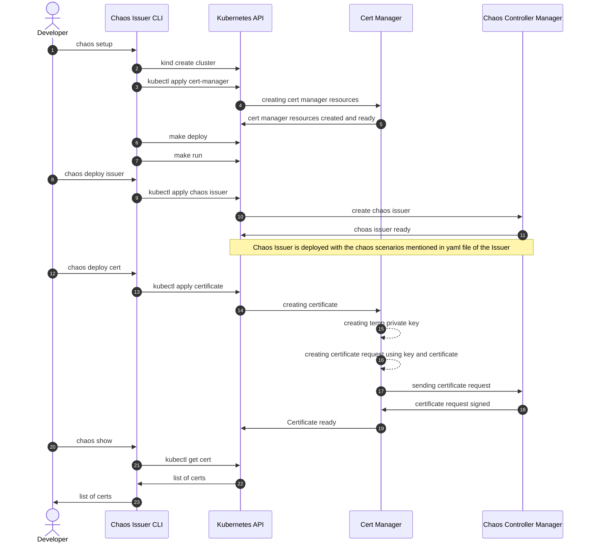

# Sequence Diagram #
## Shows all possible commands which can be given by a developer to our shell script. ##
## About choas scenarios: ##
How chaos scenarios will work is that the developer will provide the parameters inside the issuer.yaml file and once it reaches our controller manager, it takes action based on the inputs written in the file. For example, if the developer wants to make the issuer sleep for X amount of time before signing the certificate, then it can pass that parameter as: 
```sh
apiVersion: self-signed-issuer.chaos.ch/v1alpha1
kind: ChaosIssuer
metadata:
  name: chaosissuer-scenario3
spec:
  selfSigned: {}
  Scenario3:
    duration: 10
```
Now everytime, the issuer signs the certificate, it'll sleep for 10 seconds before signing it. the delay will be logged as well for getting metrics.



